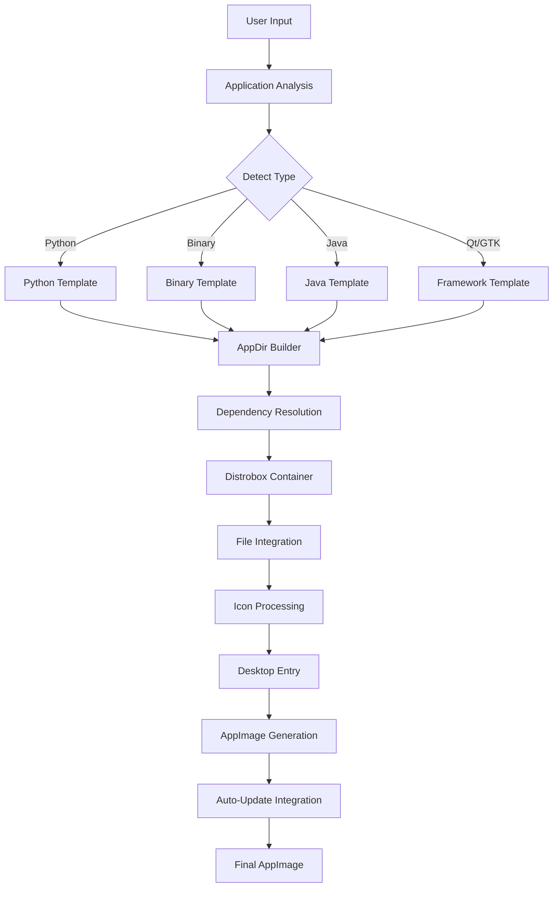

<div align="center">

# 📦 AppImage Creator

**Modern GTK4/Libadwaita Application for Creating AppImages**

[](LICENSE)
[](https://www.python.org/)
[](https://www.gtk.org/)
[](https://gnome.pages.gitlab.gnome.org/libadwaita/)

Create portable AppImages from any Linux application with an intuitive interface.
Supports Python, Qt, GTK, Java, Electron, and more.

</div>

***

## 📖 Overview

AppImage Creator is a comprehensive tool for packaging Linux applications into portable AppImage format. Built with modern GTK4 and Libadwaita, it provides a native GNOME experience with powerful features for developers and packagers.

**Key Highlights:**
- 🎨 **Beautiful Interface** - Modern GTK4/Libadwaita UI
- 🔍 **Smart Detection** - Automatically detects application type and dependencies
- 🔄 **Auto-Update System** - Built-in update notifications for end users
- 🌍 **Multi-Language** - Full internationalization support
- 🐳 **Distrobox Integration** - Cross-distribution builds in containers
- 📦 **Template System** - Flexible launchers for different app types

***

## 📋 Features

### Core Capabilities
- **Multi-Platform Support** - Python, Java, Shell scripts, Qt, GTK, Electron, and binary applications
- **Wrapper Script Analysis** - Advanced analysis of complex wrapper scripts
- **Auto-Discovery** - Automatically finds related files (locale, icons, desktop files)
- **Icon Processing** - Automatic conversion and resizing with fallback generation
- **Progress Tracking** - Real-time build progress with detailed logging
- **Structure Preview** - Preview AppImage contents before building

### Auto-Update System
Built-in automatic update checking provides end users with:
- 🔔 Beautiful GTK4 update notifications
- 📊 Visual download progress with MB counter
- 📝 Release notes display with Markdown support
- 🌐 Multi-language support (auto-detects system locale)
- 🔄 One-click update and install
- ⚙️ GitHub Releases API integration

***

## 🚀 Installation

### Prerequisites

**Required Dependencies:**
```bash
# Arch Linux
sudo pacman -S distrobox gtk4 libadwaita python python-pillow python-gobject vte4

# Fedora
sudo dnf install distrobox gtk4 libadwaita python3 python3-pillow python3-gobject vte4

# Ubuntu/Debian
sudo apt install distrobox gtk4 libadwaita python3 python3-pil python3-gi gir1.2-vte-3.91
```

**Optional Dependencies:**
- `fuse2` or `fuse3` - For running AppImage tools
- `librsvg` - For SVG icon conversion (rsvg-convert)
- `imagemagick` - Alternative icon conversion
- `docker` or `podman` - Container runtime for distrobox

### Quick Start

**From Source:**
```bash
git clone https://github.com/BigCommunity/appimage-creator.git
cd appimage-creator
python usr/share/appimage-creator/main.py
```

**Arch Linux Package:**
```bash
cd pkgbuild
makepkg -si
appimage-creator
```

***

## 🏗️ Architecture



### Build Process Flow

1. **Analysis Phase** - Detect application type and structure
2. **Environment Setup** - Create/reuse Distrobox container
3. **AppDir Creation** - Build standard directory structure
4. **Dependency Resolution** - Install system dependencies in container
5. **File Integration** - Copy application files and resources
6. **Launcher Generation** - Create appropriate launcher script
7. **Icon Processing** - Convert icons to required sizes
8. **Desktop Integration** - Generate .desktop file
9. **AppImage Creation** - Use appimagetool or linuxdeploy
10. **Update Configuration** - Embed auto-update metadata

***

## 📁 Project Structure

```
appimage-creator/
├── usr/
│   ├── bin/
│   │   └── appimage-creator              # Shell wrapper
│   └── share/
│       ├── appimage-creator/             # Main application
│       │   ├── main.py                   # Entry point
│       │   ├── core/                     # Core modules
│       │   │   ├── builder.py           # Build orchestration
│       │   │   ├── environment_manager.py
│       │   │   ├── app_info.py
│       │   │   └── structure_analyzer.py
│       │   ├── ui/                       # User interface
│       │   │   ├── app.py
│       │   │   ├── window.py
│       │   │   ├── pages.py
│       │   │   ├── widgets.py
│       │   │   └── dialogs.py
│       │   ├── templates/                # Application templates
│       │   │   ├── base.py
│       │   │   └── app_templates.py
│       │   ├── generators/               # File generators
│       │   │   ├── icons.py
│       │   │   └── files.py
│       │   ├── updater/                  # Auto-update system
│       │   │   ├── checker.py
│       │   │   ├── downloader.py
│       │   │   ├── update_window.py
│       │   │   └── check_updates.py
│       │   ├── utils/                    # Utilities
│       │   │   ├── i18n.py
│       │   │   ├── system.py
│       │   │   └── file_ops.py
│       │   └── validators/               # Input validation
│       │       └── validators.py
│       ├── applications/                 # Desktop entries
│       │   └── org.communitybig.appimage.desktop
│       ├── icons/                        # Application icons
│       │   └── hicolor/scalable/apps/
│       │       └── appimage-creator.svg
│       └── locale/                       # Translations
│           └── [lang]/LC_MESSAGES/
├── locale/                               # Source translations
│   └── *.json
├── pkgbuild/                            # Arch packaging
│   ├── PKGBUILD
│   └── pkgbuild.install
├── CLAUDE.md                            # AI assistant guide
├── GITHUB_TOKEN_SETUP.md                # GitHub setup guide
└── README.md                            # This file
```

***

## 🎯 Usage Guide

### Basic Workflow

1. **Launch Application**
   ```bash
   appimage-creator
   ```

2. **Configure Application Info**
   - Enter application name
   - Set version number (e.g., 1.0.0)
   - Select main executable
   - Choose icon (optional)

3. **Configure Auto-Update (Optional)**
   - Click button to fill GitHub template
   - Edit `OWNER/REPO` to match your repository
   - Example: `https://api.github.com/repos/biglinux/myapp/releases/latest`
   - Set filename pattern: `myapp-*-x86_64.AppImage`

4. **Advanced Settings**
   - Select application categories
   - Choose build environment (Ubuntu/Debian/Fedora/Arch)
   - Add additional directories if needed

5. **Build AppImage**
   - Review structure preview
   - Click "Build" to generate AppImage
   - Monitor progress in real-time

### Supported Application Types

| Type | Detection | Template | Features |
|------|-----------|----------|----------|
| **Binary** | ELF executable | BinaryAppTemplate | Direct execution |
| **Python** | `.py` shebang | PythonAppTemplate | Python environment |
| **Python Wrapper** | Complex scripts | PythonWrapperAppTemplate | Advanced detection |
| **Shell Script** | Shell shebang | ShellAppTemplate | Script execution |
| **Java** | `.jar` files | JavaAppTemplate | JVM setup |
| **Qt** | Qt libraries | QtAppTemplate | Qt environment |
| **GTK** | GTK libraries | GtkAppTemplate | GTK schemas/typelibs |
| **Electron** | Electron app | ElectronAppTemplate | Electron runtime |

### Auto-Update Configuration

**For Developers:**
Configure update checking in your AppImage during build:

```yaml
Update URL: https://api.github.com/repos/OWNER/REPO/releases/latest
Filename Pattern: myapp-*-x86_64.AppImage
```

**For End Users:**
AppImages with auto-update enabled will:
- Check for updates every hour automatically
- Show notification when update is available
- Display release notes and version info
- Allow one-click update with progress tracking
- Update seamlessly without losing data

***

## 🔧 Development

### Running from Source

```bash
# Clone repository
git clone https://github.com/BigCommunity/appimage-creator.git
cd appimage-creator

# Run directly
python usr/share/appimage-creator/main.py
```

### Building Package

```bash
# Arch Linux
cd pkgbuild
makepkg -f

# Install locally
sudo pacman -U appimage-creator-*.pkg.tar.zst
```

### Translation Workflow

Translations use JSON format in `locale/` directory:

```bash
# Translations are auto-generated via GitHub Actions
# using attranslate and Azure/OpenAI services
locale/
├── en.json      # English (fallback to source strings)
├── pt_BR.json   # Portuguese (Brazil)
├── es.json      # Spanish
└── ...
```

**Do not manually edit** files in `usr/share/locale/` - they are auto-generated.

### Dependencies Management

System dependencies are defined in `core/builder.py`:

```python
SYSTEM_DEPENDENCIES = {
    'glib': {
        'libraries': ['libglib-2.0.so', 'libgio-2.0.so'],
        'essential': True
    },
    'gtk3': {
        'libraries': ['libgtk-3.so'],
        'typelibs': ['Gtk-3.0']
    },
    # ... more dependencies
}
```

***

## 🛠️ Troubleshooting

### Common Issues

**AppImage tools not found:**
- Tools (appimagetool, linuxdeploy) are auto-downloaded on first use
- Requires `fuse2` or `fuse3` to run downloaded tools

**Permission denied on executable:**
- Ensure selected executable has execute permissions: `chmod +x file`

**Icon processing fails:**
- Install optional tools: `librsvg`, `imagemagick`, or `inkscape`
- Application will generate fallback icon if tools unavailable

**Build fails in container:**
- Check Distrobox is properly installed
- Verify container runtime (podman/docker) is working
- Try different build environment (Ubuntu/Fedora/Arch)

**Update notifications not appearing:**
- Verify GitHub API URL is correct
- Check filename pattern matches actual AppImage name
- Ensure graphical environment is available (X11/Wayland)

### Debug Mode

Enable verbose logging:
```bash
python usr/share/appimage-creator/main.py --debug
```

Check build logs in console output for detailed error messages.

***

## 🤝 Contributing

We welcome contributions! Here's how you can help:

1. **Fork** the repository
2. **Create** a feature branch (`git checkout -b feature/amazing-feature`)
3. **Commit** your changes (`git commit -m 'Add amazing feature'`)
4. **Push** to the branch (`git push origin feature/amazing-feature`)
5. **Open** a Pull Request

### Guidelines

- Follow existing code style and structure
- Add comments for complex logic
- Update documentation for new features
- Test thoroughly before submitting
- Use English for code and comments

***

## 📄 License

This project is licensed under the **MIT License** - see the [LICENSE](LICENSE) file for details.

***

## 🙏 Acknowledgments

- **GTK/GNOME Teams** - Excellent toolkit and design system
- **AppImage Project** - Portable application format
- **Distrobox** - Container-based build environments
- **BigLinux Community** - Testing and feedback
- All contributors and users

***

<div align="center">

**Made with ❤️ by [BigCommunity](https://github.com/BigCommunity)**

[Report Bug](https://github.com/BigCommunity/appimage-creator/issues) · [Request Feature](https://github.com/BigCommunity/appimage-creator/issues) · [Documentation](CLAUDE.md)

</div>
