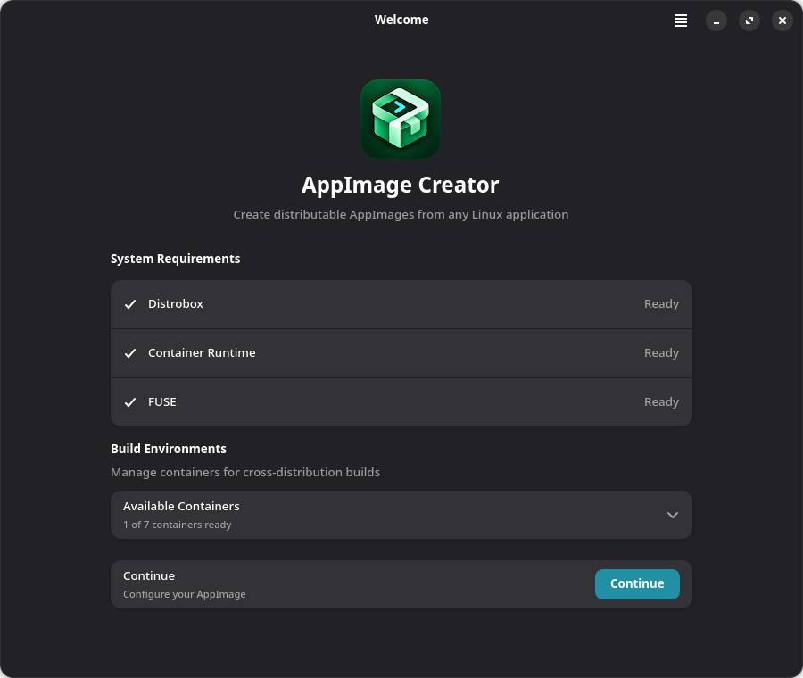
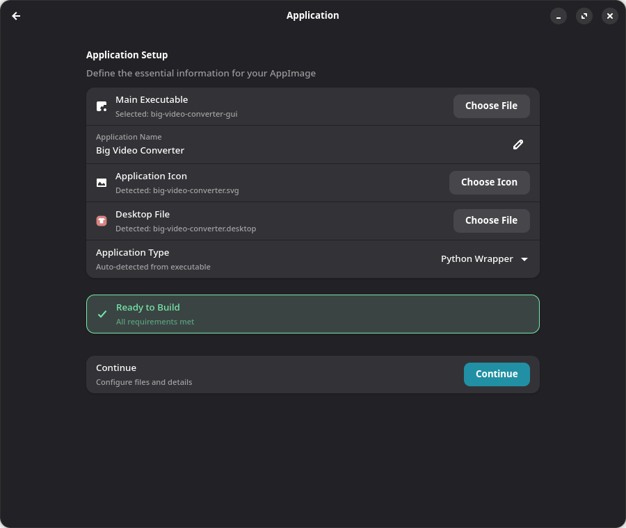
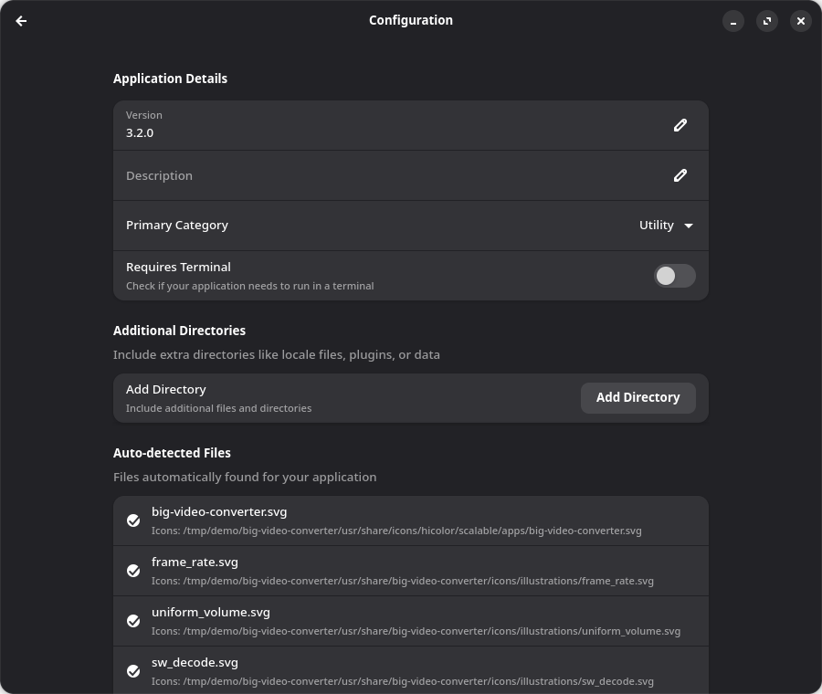
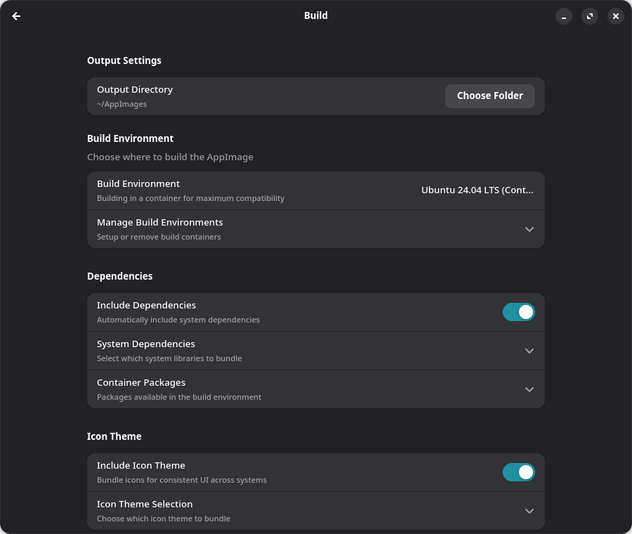
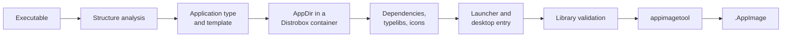

<div align="center">


# AppImage Creator

**Turn any Linux application into a portable AppImage — with a modern GTK4/Libadwaita interface.**

[](COPYING)
[](https://www.python.org/)
[](https://www.gtk.org/)
[](https://gnome.pages.gitlab.gnome.org/libadwaita/)

Python · GTK · Qt · Java · Electron · Shell scripts · Compiled binaries (Rust, Go, C/C++…)



</div>

---

## Overview

AppImage Creator packages an existing Linux application into a single, portable `.AppImage` file. Point it at the program's executable and it works out the rest: what kind of application it is, which files belong to it, which system libraries it needs, and how it should be launched.

Builds run inside [Distrobox](https://distrobox.it/) containers based on older, widely compatible distributions, so the resulting AppImage runs on far more systems than one built against your own (often newer) libraries.

### Highlights

- **Smart detection** — identifies the application type, its project root, desktop file, icons and translations, even behind complex wrapper scripts.
- **Container builds** — seven ready-to-use build environments (Ubuntu, Debian, Fedora, AlmaLinux) managed from the app.
- **Dependency bundling** — GTK3/GTK4, Libadwaita, VTE, Qt, GStreamer, MPV, libsecret and more, including GObject typelibs and libraries loaded only at runtime (`dlopen`).
- **Multiple launchers** — a package that ships several executables (e.g. a GUI and a CLI) becomes one AppImage with all of them.
- **Built-in auto-update** — optional update notifications for your users, from GitHub Releases or your own server.
- **Desktop integration** — generated AppImages can add themselves to the application menu.

---

## Screenshots

<table>
  <tr>
    <td width="50%">
      
      <p align="center"><b>Application</b> — pick the executable; type, icon and desktop file are detected automatically.</p>
    </td>
    <td width="50%">
      
      <p align="center"><b>Configuration</b> — version, category and every file that will be bundled.</p>
    </td>
  </tr>
  <tr>
    <td colspan="2" align="center">
      
      <p align="center"><b>Build</b> — choose the build environment, dependencies and icon theme.</p>
    </td>
  </tr>
</table>

---

## Installation

### Requirements

| Required | Optional |
|----------|----------|
| `python` 3.10+, `python-gobject`, `python-pillow` | `fuse2` / `fuse3` — run the AppImage tools |
| `gtk4`, `libadwaita`, `vte4` | `librsvg` / `imagemagick` — SVG icon conversion |
| `distrobox` with `podman` or `docker` | |

```bash
# Arch Linux / BigLinux / Manjaro
sudo pacman -S distrobox podman gtk4 libadwaita vte4 python python-gobject python-pillow

# Fedora
sudo dnf install distrobox podman gtk4 libadwaita vte291-gtk4 python3 python3-gobject python3-pillow

# Ubuntu / Debian
sudo apt install distrobox podman libgtk-4-1 libadwaita-1-0 gir1.2-adw-1 gir1.2-vte-3.91 python3 python3-gi python3-pil
```

### Arch Linux package

```bash
git clone https://github.com/big-comm/appimage-creator.git
cd appimage-creator/pkgbuild
makepkg -si
```

### Run from source

```bash
git clone https://github.com/big-comm/appimage-creator.git
cd appimage-creator
python usr/share/appimage-creator/main.py
```

`appimagetool` and `linuxdeploy` are downloaded automatically on first use and cached in `~/.cache/appimage-creator/tools/`.

---

## Usage

1. **Welcome** — check that Distrobox, the container runtime and FUSE are ready, and create a build container (Ubuntu 24.04 LTS is a good default).
2. **Application** — choose the main executable and give the application a name. Its type, icon and `.desktop` file are filled in automatically; change them if needed.
3. **Configuration** — set the version, description and category, review the auto-detected files and add extra directories if the app needs them. Optionally configure auto-update.
4. **Build** — choose the output folder and build environment, review the dependencies to bundle, and click **Build**. Progress and the full build log are shown live, and the build can be cancelled at any time.

The result is written as `<name>-<version>-<arch>.AppImage`.

### Supported application types

| Type | How it is detected | Notes |
|------|--------------------|-------|
| Python | `.py` file / Python shebang | Bundled virtual environment with the project's requirements |
| Python wrapper | Shell script that runs Python | Resolves the real script, including paths built from shell variables |
| GTK / Qt | Imports and linked libraries | Bundles the toolkit, typelibs and schemas |
| Binary | ELF executable | Compiled projects (Cargo, Go, Meson, CMake, Zig…) ship the binary, not the source tree |
| Java | `.jar` | JVM launcher |
| Electron | Electron app folder | Wayland-friendly app ID |
| Shell script | Shell shebang | Script launcher |

### Build environments

| Environment | Best for |
|-------------|----------|
| Ubuntu 24.04 LTS · 22.04 LTS · 20.04 LTS | Broad compatibility (20.04 has no GTK4) |
| Debian 12 · Debian 11 | Conservative, very stable bases |
| Fedora 41 | Newest libraries |
| AlmaLinux 9 | RHEL-compatible systems |

An AppImage runs on systems with the same or newer libraries than the one it was built on, so pick the oldest environment that still provides what your app needs. **Local** builds (no container) are possible but much less portable.

---

## Auto-update

When an update source is configured, the AppImage checks for new versions in the background (hourly, via a user systemd timer) and shows a GTK update window with the release notes, a download progress bar and a one-click update.

**GitHub Releases**

```
Update URL:       https://api.github.com/repos/OWNER/REPO/releases/latest
Filename pattern: myapp-*-x86_64.AppImage
```

**Your own server** — publish a JSON file:

```json
{
    "version": "1.2.3",
    "download_url": "https://example.com/downloads/myapp-1.2.3-x86_64.AppImage",
    "release_notes": "## New\n- Feature A\n- Fix B"
}
```

```
Update URL:       https://example.com/update.json
Filename pattern: myapp-*-x86_64.AppImage
```

The source type is detected from the URL.

<details>
<summary><b>GitHub API rate limit (optional token)</b></summary>

Unauthenticated GitHub API requests are limited to 60 per hour per IP. A personal access token raises this to 5,000. Create a classic token at [github.com/settings/tokens](https://github.com/settings/tokens) **without selecting any scope** (public, read-only access is all that is needed), then either:

- export it for your session: `export GITHUB_TOKEN="ghp_..."`, or
- embed it in an AppImage you distribute by temporarily changing `DEFAULT_GITHUB_TOKEN` in `usr/share/appimage-creator/updater/checker.py` before building — and revert the change before committing, as GitHub blocks pushes that contain tokens.

</details>

---

## How it works


```mermaid
flowchart LR
    A[Executable] --> B[Structure analysis]
    B --> C[Application type<br/>and template]
    C --> D[AppDir in a<br/>Distrobox container]
    D --> E[Dependencies,<br/>typelibs, icons]
    E --> F[Launcher and<br/>desktop entry]
    F --> G[Library validation]
    G --> H[appimagetool]
    H --> I[.AppImage]
```

1. **Analysis** — detect the application type, project root, entry points and resources.
2. **Environment** — validate the build container and install any missing native packages.
3. **AppDir** — copy the application, then bundle a Python environment, system libraries, typelibs and icons as required.
4. **Launcher** — generate the `AppRun` script and the desktop entry.
5. **Validation** — check that every bundled library resolves before packaging.
6. **Packaging** — produce the final AppImage with `appimagetool`.

---

## Development

### Project layout

```
usr/share/appimage-creator/
├── main.py              # Entry point
├── core/                # Build pipeline: builder, structure analysis,
│                        # environments, dependency resolution, bundlers
├── ui/                  # GTK4/Libadwaita window, pages and dialogs
├── templates/           # Launcher templates per application type
├── generators/          # Icon processing, desktop file and AppRun generation
├── updater/             # Auto-update checker, downloader and window
├── utils/               # i18n, system helpers, file operations
└── validators/          # Input validation
```

System dependency profiles (libraries and typelibs for GTK, Qt, VTE, MPV…) live in `core/build_config.py`.

### Translations

Translations use gettext and are maintained in the repository (CI no longer generates them):

- `locale/<lang>.po` — the main application (`appimage-creator` domain), 28 languages.
- `locale/appimage-updater/<lang>.po` — the update window bundled into generated AppImages (`appimage-updater` domain).

After adding or changing strings, extract them with `xgettext` into the `.pot`, update every `.po` (each must translate all strings, keeping `{}` placeholders), then compile the `.mo` files:

```bash
./locale/compile-translations.sh
```

Do not edit the compiled files in `usr/share/locale/` or `usr/share/appimage-creator/updater/locale/` by hand.

### Code style

The project is linted with [Ruff](https://docs.astral.sh/ruff/):

```bash
ruff check usr/share/appimage-creator
```

---

## Troubleshooting

**The build fails while installing packages in the container** — open the build log: it lists the packages that were requested and the package manager's error. Packages that do not exist in the selected distribution are skipped automatically.

**The AppImage starts on the build system but not elsewhere** — build in an older environment (for example Ubuntu 22.04 instead of 24.04), and check the *library validation* section of the build log for unresolved libraries.

**`appimagetool` or `linuxdeploy` will not run** — install `fuse2` or `fuse3`. To force a fresh download, delete `~/.cache/appimage-creator/tools/`.

**The executable cannot be selected** — make sure it is executable: `chmod +x <file>`.

---

## Contributing

Contributions are welcome:

1. Fork the repository and create a branch: `git checkout -b feature/my-feature`
2. Commit your changes and push the branch
3. Open a pull request

Please keep code and comments in English, follow the existing style and run `ruff check` before submitting.

---

## License

AppImage Creator is free software released under the **GNU General Public License v3.0** — see [COPYING](COPYING).

<div align="center">

Made by [BigCommunity](https://github.com/big-comm) · [Report a bug](https://github.com/big-comm/appimage-creator/issues) · [Request a feature](https://github.com/big-comm/appimage-creator/issues)

</div>
